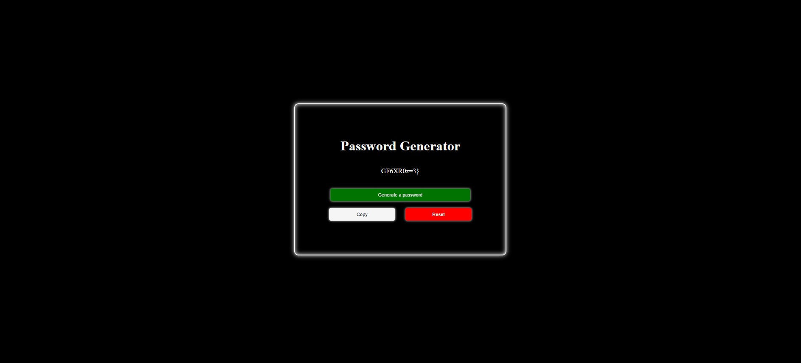
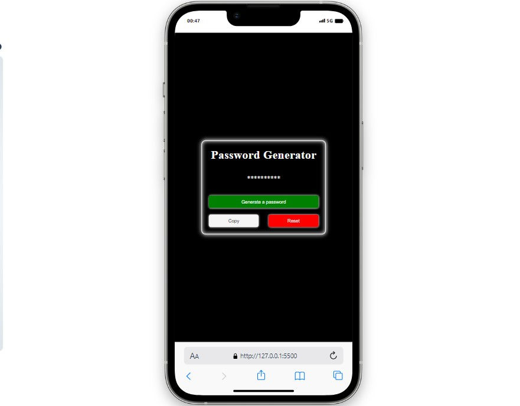

# Password Generator

This is a simple web application that allows users to generate secure passwords with various options for customization.

## Live Link

[Password Generator](https://password-genarator-delta.vercel.app/)
## Screenshots



## Features

- **Random Password Generation**: Users can generate random passwords with a click of a button.
- **Customizable Options**: Users can specify the length of the password and choose whether to include uppercase letters, lowercase letters, numbers, and symbols.
- **Copy to Clipboard**: Generated passwords can be easily copied to the clipboard for convenience.
- **User-Friendly Interface**: The interface is designed to be intuitive and easy to use.

## Technologies Used

- HTML
- CSS
- JavaScript
- Font Awesome Icons
- Notyf (for notifications)

## How to Use

1. Open the web page in your browser.
2. Adjust the desired settings for the password generation, including character length and inclusion of uppercase letters, lowercase letters, numbers, and symbols.
3. Click on the "Generate" button to generate a random password based on your chosen settings.
4. If you want to reset the password display, click on the "Reset" button.
5. To copy the generated password to your clipboard, click on the "Copy" button.

## Responsive Design



## File Structure

- `index.html`: HTML file containing the structure of the web page.
- `style.css`: CSS file used for styling HTML elements.
- `app.js`: JavaScript file containing the logic for password generation and user interactions.
- `notyf.min.js` and `notyf.min.css`: Notyf library files for displaying notifications.
- `favicon.ico` and `lock.png`: Favicon images used for the web page.

## Installation

1. Clone the repository to your local machine:

   ```bash
   git clone https://github.com/username/password-generator.git

